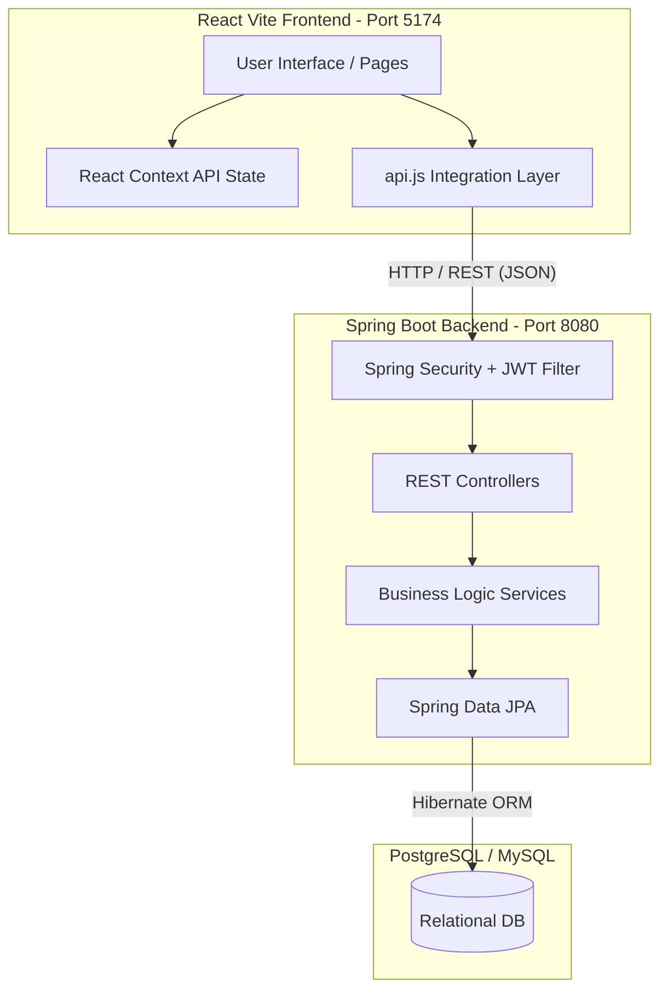
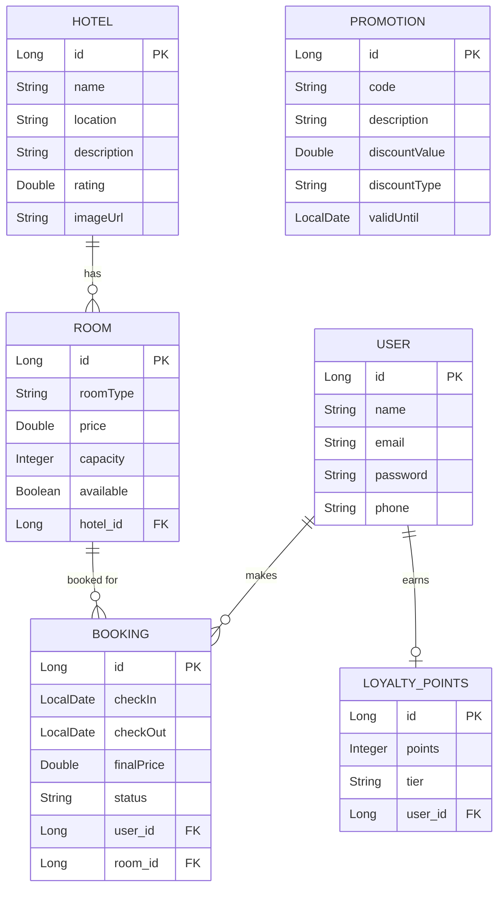

# StayLux - Premium Hotel Booking Platform

**StayLux** is a full-stack, modularly-developed hotel reservation and property management platform. It offers a seamless user experience for finding, filtering, and booking premium hotel rooms, alongside a robust and secure Spring Boot backend architecture. 

This project was built progressively, prioritizing a strict separation of concerns and a unified API integration between a React/Vite frontend and a Java Spring Boot backend.

---

## 🏗 System Architecture

The system follows a standard three-tier architecture: **Client (Frontend)** ↔ **Server (Backend API)** ↔ **Database**.



---

## 🗄️ Database Design (ER Diagram)

The application utilizes a fully relational database schema designed for data integrity and efficient queries.



---

## 💻 Technology Stack

### Frontend
- **Framework:** React.js powered by Vite (for fast HMR and optimized builds)
- **Styling:** Pure Vanilla CSS (`index.css`) emphasizing custom, dynamic glassmorphism and modern UI design. No heavy UI frameworks (like Bootstrap or Tailwind) were used, providing complete control over the design system.
- **Routing:** React Router v6 for Single Page Application (SPA) navigation.
- **Icons:** Lucide React for consistent, scalable SVG iconography.
- **State Management:** React Context API (`AuthContext`, `ToastContext`).

### Backend
- **Core:** Java 17+, Spring Boot 3.x
- **Security:** Spring Security with stateless JWT (JSON Web Tokens) for robust authentication and authorization.
- **Database Access:** Spring Data JPA / Hibernate for object-relational mapping.
- **Database Engine:** MySQL/PostgreSQL 
- **Build Tool:** Maven

---

## 🚀 Local Setup Instructions

The project has been separated into two distinct folders for modularity: `frontend/` and `hotelmgmt/` (backend). You will need to start both servers concurrently.

### 1. Backend Setup (`hotelmgmt/`)
The backend is a Maven-based Spring Boot application.

1. Navigate to the backend directory:
   ```bash
   cd hotelmgmt
   ```
2. Ensure you have your database running (MySQL/PostgreSQL) and update `src/main/resources/application.properties` with your credentials if necessary.
3. Build and run the server using Maven:
   ```bash
   mvn spring-boot:run
   ```
   *The backend will start on **http://localhost:8080** and automatically seed initial hotel and room data into the database.*

### 2. Frontend Setup (`frontend/`)
The frontend is a fast React application powered by Vite.

1. Open a new terminal window and navigate to the frontend directory:
   ```bash
   cd frontend
   ```
2. Install the Node.js dependencies:
   ```bash
   npm install
   ```
3. Start the Vite development server:
   ```bash
   npm run dev
   ```
   *The frontend will typically start on **http://localhost:5174** (or 5173).*

---

## 🧩 Development Methodology (Modular Approach)

The application was built using a highly modular and iterative approach. Rather than building a monolith, the project was carefully separated to ensure scalability and maintainability.

1. **Entity First, Controller Last (Backend):**
   - We started by designing strict database entities (`User`, `Hotel`, `Room`, `Booking`, `Promotion`).
   - Built the Repository layer (JPA).
   - Designed isolated Service layers containing the core business logic (e.g., preventing double-booking, calculating prices, validating promo codes).
   - Finally, exposed these services via RESTful Controllers with clean, consistent JSON DTOs.

2. **Security & RBAC Refactoring:**
   - Initially built with complex Role-Based Access Control (Admin vs User), the project was later streamlined. Administrative endpoints were removed to create a flat, user-first security model, dramatically simplifying the authentication flow.
   - JWT validation runs on a centralized filter before hitting any controller.

3. **Frontend Componentization:**
   - The UI was broken down into reusable components (`HotelCard`, `SearchBar`, etc.).
   - Global state (Authentication, Toast notifications) was abstracted into React Context Providers (`AuthContext`, `ToastContext`).
   - Hardcoded mock data was utilized initially to design the UI rapidly without backend dependencies.

4. **API Bridge Layer:**
   - Rather than sprinkling `fetch()` calls throughout React components, we established a centralized `api.js` layer.
   - `api.js` automatically handles JWT attachment, CORS configurations, error throwing, and Data Transfer Object (DTO) mapping to convert complex backend entity relations into flat, UI-friendly objects.

---

## 🔑 Core Features & API Endpoints

The API is fully RESTful and designed to be consumed by the React frontend.

### 🏨 Hotel & Room Discovery
- **`GET /hotels/all`**: Fetches all properties in the system.
- **`GET /hotels/search`**: Advanced filtering by location, price, rating, and category.
- **`GET /hotels/{id}`**: Retrieves detailed information for a specific hotel.
- **`GET /rooms/hotel/{id}`**: Retrieves all available rooms for a specific property.

### 📅 Booking Engine
- **`POST /bookings/book`**: Securely processes reservations. The backend enforces capacity checks and applies valid promo codes.
- **`GET /bookings/my-bookings`**: Retrieves the authenticated user's complete history (upcoming, completed, cancelled).
- **`DELETE /bookings/cancel/{id}`**: Cancels an active booking and updates the room's availability.

### 🛡 Authentication & Loyalty
- **`POST /auth/login`**: Authenticates a user and returns a JWT.
- **`POST /auth/register`**: Creates a new user profile.
- **`GET /bookings/my-loyalty`**: Returns the user's loyalty tier (Silver, Gold, Platinum) and accumulated points based on their booking history.

---

## 🔮 Future Scope

While StayLux provides a complete booking experience, there are several avenues for future enhancement:
1. **Payment Gateway Integration:** Integrate Stripe or PayPal to handle real monetary transactions securely during the checkout process.
2. **Dynamic Pricing Engine:** Implement an algorithm to adjust room prices based on seasonality, occupancy rates, and local events.
3. **Admin Dashboard:** Reintroduce a dedicated, secure administrator portal for hotel managers to add new properties, manage staff, and view financial analytics.
4. **Real-time Notifications:** Use WebSockets or Server-Sent Events (SSE) to provide users with instant notifications about their booking status or limited-time promotions.
5. **Review and Rating System:** Allow users who have completed a stay to leave verified reviews and photos of their experience.

---

## 🚧 Challenges and Limitations

1. **Concurrency Control:** Currently, the system relies on basic availability checks. High-traffic scenarios where two users attempt to book the exact same room at the exact same millisecond could result in a double-booking race condition. Implementing optimistic locking (`@Version` in Hibernate) would mitigate this.
2. **Monolithic Architecture:** The backend is currently a Spring Boot monolith. While suitable for a startup or hackathon, scaling the system globally might require breaking down domains (e.g., Auth, Inventory, Booking) into separate microservices.
3. **Session Revocation:** Since the application uses stateless JWTs, immediate token revocation (e.g., logging a user out of all devices instantly) is challenging without implementing a token blocklist in Redis.
4. **Search Performance:** The hotel search feature currently queries the relational database directly. For larger datasets, integrating Elasticsearch or a similar search engine would dramatically improve search speeds and allow for fuzzy matching.

---

## ✨ Design Philosophy
StayLux prioritizes visual excellence. The UI features dark-mode aesthetics, rich gradients, dynamic micro-animations, and glassmorphism elements, ensuring a premium user experience that matches the luxury properties listed on the platform.
